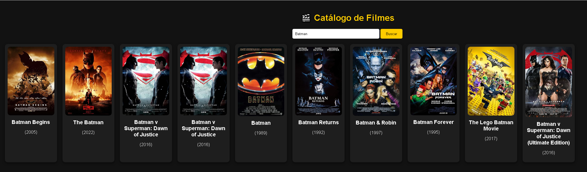

# 🎬 Catálogo de Filmes - PHP + OMDb API

Este projeto é um **mini catálogo de filmes** desenvolvido em **PHP + JavaScript (AJAX)**, que consome a **OMDb API** para buscar informações de filmes e exibir em uma interface web com **HTML**.
O usuário pode pesquisar pelo nome de um filme e visualizar pôster, título e ano de lançamento em cards estilizados.

---

## 🚀 Funcionalidades

🔎 Busca de filmes por nome.
⚡ Atualização dinâmica dos resultados via AJAX (sem reload da página).
📄 Paginação para navegar entre múltiplas páginas de resultados.
🎭 Exibição de informações principais **cards responsivos** (poster, título, ano).
📝 Estrutura pronta para exibir mais detalhes (atores, enredo, nota IMDb).
🛠 Consumo da **OMDb API** usando PHP.
📨 Mensagem de aviso caso nenhum filme seja encontrado.

---

## 📸 Demonstração


_(Substitua por um print real do seu projeto)_

---

## 🛠️ Tecnologias Utilizadas

- **PHP** → Backend responsável por consumir a API.
- **HTML5** (estrutura do site)
- **OMDb API** (fonte dos dados de filmes)
- **Bootstrap** (visual mais bonito e responsivo)
- **Página de detalhes** (ator, enredo, diretor, nota IMDb)
- **JavaScript (AJAX)** → Atualização dinâmica da lista de filmes.

---

## 📦 Como Executar o Projeto

1. Clone este repositório:

   ```bash
   git clone https://github.com/igortriveloni86/php_api_filmes.git
   ```

2. Acesse a pasta do projeto:

   ```bash
   cd catalogo-filmes-php
   ```

3. Substitua a sua chave da OMDb no código:

   ```php
   $apiKey = "SUA_API_KEY";
   ```

   > Para obter uma chave gratuita, cadastre-se em: [OMDb API](https://www.omdbapi.com/apikey.aspx)

4. Inicie um servidor PHP local:

   ```bash
   php -S localhost:8000
   ```

5. Abra no navegador:

   ```
   http://localhost:8000
   ```

---

## 📜 Licença

Este projeto está sob a licença MIT.
Sinta-se livre para usar, modificar e compartilhar!

---

👨‍💻 Autor

Desenvolvido por Igor Triveloni 🚀
