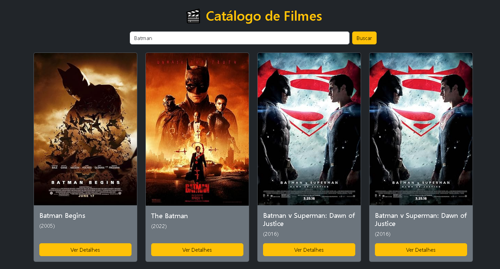

# 🎬 Catálogo de Filmes - PHP + OMDb API

Este projeto é um **mini catálogo de filmes** desenvolvido em **PHP**, que consome a **OMDb API** para buscar informações de filmes e exibir em uma interface web com **HTML + CSS**.
O usuário pode pesquisar pelo nome de um filme e visualizar pôster, título e ano de lançamento em cards estilizados.

---

## 🚀 Funcionalidades

- Campo de busca para pesquisar filmes.
- Consumo da **OMDb API** usando PHP.
- Exibição dos filmes em formato de **cards responsivos** (título, ano, pôster).
- Tratamento de filmes sem pôster disponível (imagem padrão).
- Mensagem de aviso caso nenhum filme seja encontrado.

---

## 📸 Demonstração



---

## 🛠️ Tecnologias Utilizadas

- **PHP** (para consumo da API e exibição dos dados)
- **HTML5** (estrutura do site)
- **CSS3** (estilização, layout em grid)
- **OMDb API** (fonte dos dados de filmes)

---

## 📦 Como Executar o Projeto

1. Clone este repositório:

   ```bash
   git clone https://github.com/igortriveloni86/PHP_API_FILMES.git
   ```

2. Acesse a pasta do projeto:

   ```bash
   cd PHP_API_FILMES
   ```

3. Substitua a sua chave da OMDb no código:

   ```php
   $apiKey = "SUA_API_KEY";
   ```

   > Para obter uma chave gratuita, cadastre-se em: [OMDb API](https://www.omdbapi.com/apikey.aspx)

4. Inicie um servidor PHP local:

   ```bash
   php -S localhost:8000
   ```

5. Abra no navegador:

   ```
   http://localhost:8000
   ```

---

## 🎨 Melhorias Futuras

- Exibir detalhes completos do filme (atores, enredo, nota IMDb).
- Implementar paginação para mais resultados.
- Usar **Bootstrap** ou **TailwindCSS** para melhorar o design.
- Adicionar busca dinâmica via **AJAX** (sem recarregar a página).

---

## 📜 Licença

Este projeto está sob a licença MIT.
Sinta-se livre para usar, modificar e compartilhar!

---

💡 Desenvolvido com PHP e criatividade 🚀
